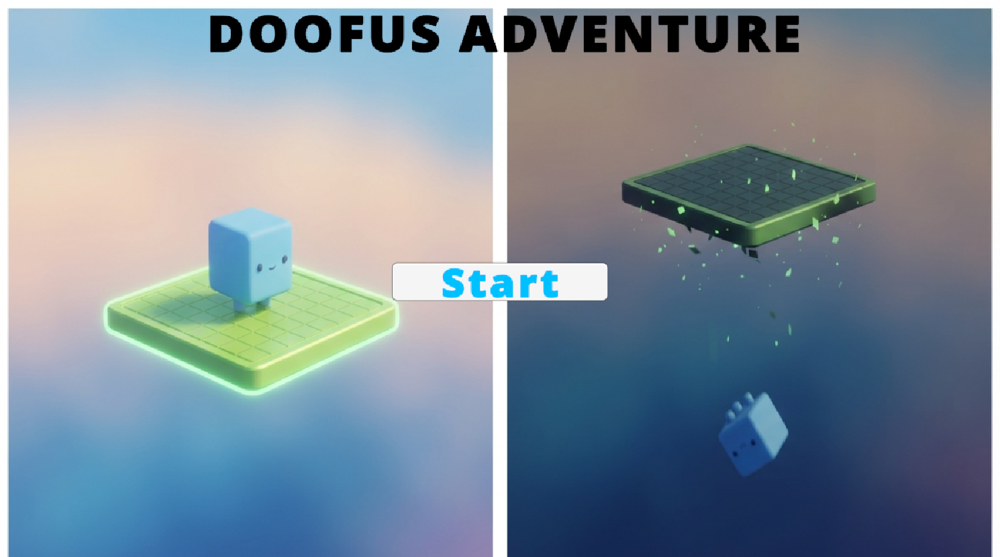
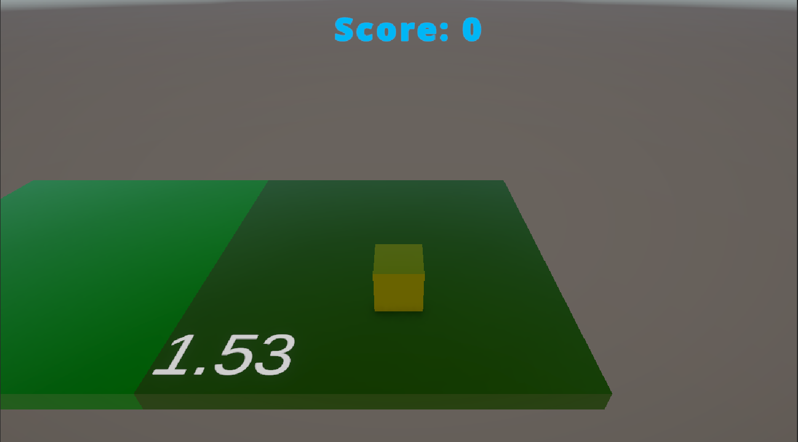
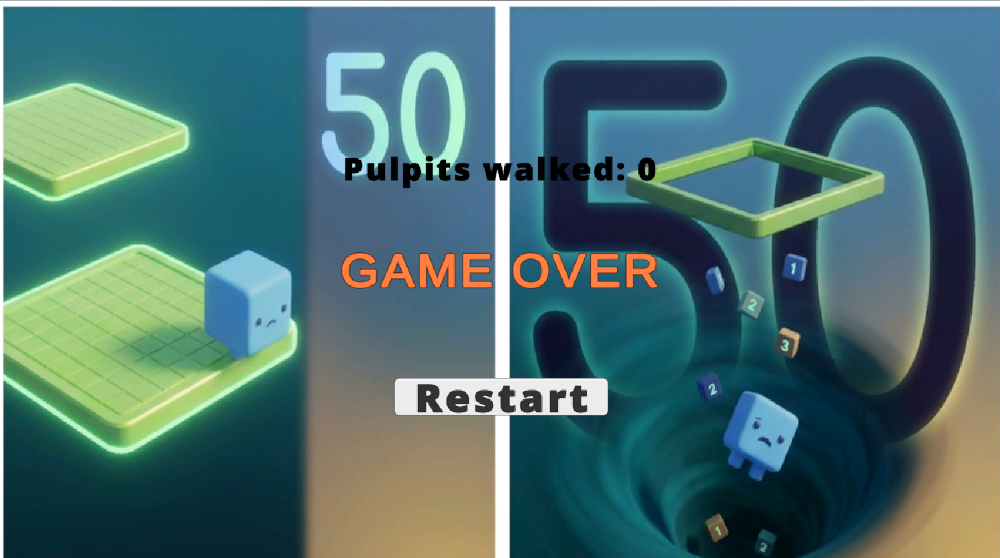

# Doofus Adventure

A 3D endless-hopper built in Unity where Doofus (a cube) has to jump across
disappearing green platforms — called **Pulpits** — for as long as possible.
Built for the Hitwicket Game Developer take-home assignment.

## Gameplay

Guide Doofus across Pulpits before they vanish. Only two Pulpits ever exist
at once; a new one spawns adjacent to the current one as its timer runs low.
Step off the edge, or wait too long on an expiring Pulpit, and Doofus falls —
game over.

## Controls

- **W / A / S / D** or **Arrow Keys** — move Doofus

## Features implemented

- **Level 1 — Movement & platform placement:** Player speed and Pulpit
  timing values are all read at runtime from the provided
  [`doofus_diary.json`](https://s3.ap-south-1.amazonaws.com/superstars.assetbundles.testbuild/doofus_game/doofus_diary.json).
  Falls back to sane defaults if the fetch fails, so the game never gets stuck.
- **Level 2 — Scoring:** Score increments each time Doofus successfully
  lands on a *new* Pulpit (not for standing still or re-landing on one
  already scored).
- **Level 3 — Start & Game Over screens:** Full game state flow
  (Loading → Start → Playing → Game Over → Restart), all driven by a
  single `GameManager` state machine, no scene reloads.

### Extra polish
- Live countdown timer displayed directly on each Pulpit
- Pulpit color shifts toward red as it nears expiry (visual warning)
- Background music + SFX for scoring, falling, and button clicks
  (music pauses on Game Over, resumes on restart)
- Milestone toast celebration at 50 Pulpits (the in-fiction challenge target),
  after which the game continues indefinitely
- Smooth camera follow

## Architecture

```
Scripts/
├─ Config/
│  ├─ GameConfig.cs        # Data classes mirroring the diary JSON
│  └─ ConfigLoader.cs      # Fetches + parses JSON, with fallback defaults
├─ Core/
│  └─ GameManager.cs       # Game state machine, score, orchestration
├─ Player/
│  └─ PlayerController.cs  # Movement, ground-check, fall detection
├─ Pulpit/
│  ├─ PulpitController.cs  # Single pulpit lifetime/countdown/events
│  └─ PulpitSpawner.cs     # Adjacency placement, spawn timing
├─ UI/
│  └─ UIManager.cs         # Reacts to GameManager state, no game logic
├─ AudioManager.cs         # Central music/SFX playback
└─ CameraFollow.cs         # Simple smoothed follow camera
```

Each system only knows about its own responsibility and communicates via
events rather than direct references where possible — e.g. `PulpitController`
doesn't know the spawner or player exist; it just reports "about to expire"
and "expired" events, and `PulpitSpawner`/`GameManager` react to them.

## Edge cases handled

- Diary JSON fetch failure / malformed JSON → falls back to default values
  (speed 3, destroy time 4–5s, spawn trigger 2.5s)
- Nonsensical JSON values (negative speed, min > max destroy time, zero
  spawn time) are sanitized before use
- Pulpit spawn positions never overlap an already-active Pulpit
- Falling is detected purely by Y-position threshold, so it doesn't matter
  whether Doofus walked off an edge or the platform vanished underneath him
- Restarting resets score, spawner state, and re-instantiates the player
  cleanly with no leftover objects from the previous run

## How to run

1. Open the project in **Unity 6000.x** or later
2. Open `Assets/Scenes/SampleScene`
3. Press Play

## Gameplay demo

See `/GameplayFootage` in this repo for a recorded playthrough video.

## Screenshots

| Start Screen | Gameplay | Game Over |
|---|---|---|
|  |  |  |

## Built with

Unity 6, C#, TextMeshPro.
